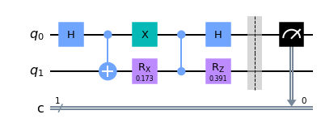

# learn_QuantumCompute

This is the Notebook in the way of learning to program the quantum computing algorithms in Quautum dynamics and quantum chemistry.

- In `test1.py` I implement the quantum circuit for the elements in the time evolution equation for **pure state**. For instance, if we want the element $A_{x,z}^R=\frac{\partial{\langle\psi|}}{\partial \theta_x}\frac{|\psi\rangle}{\partial \theta_z}$, the quantum circuit is as follows:

  ```python
  theta_x = 0.1734; theta_z = 0.3909
  qc = measure_A(theta_x, theta_z, printqc=True)
  qc.draw("mpl")
  ```

  

  And the circuits for measuring the other elements are all contained within test1.py.

- In `evolve_mix.py` I implement the quantum circuit for realizing the time evolution of **density matrix / mixed states**. For instance, we need the $\textrm{Tr}[(\frac{\partial \rho}{\partial \theta_i})^\dagger\frac{\partial \rho}{\partial \theta_j}], \forall i, j$. If $\frac{\partial \rho}{\partial \theta_i}=i B^\dagger -iB$, $\frac{\partial \rho}{\partial \theta_j}=i A^\dagger -iA$, then 
  $$
  \textrm{Tr}[(\frac{\partial \rho}{\partial \theta_i})^\dagger\frac{\partial \rho}{\partial \theta_j}]=2\textrm{Re}\textrm{Tr}[B^\dagger A]-2\textrm{Re}\textrm{Tr}[B A]
  $$
  The quantum circuit for the first part will be:

  ```
  thetas = np.random.random(6)
  qc = make_circ_m(thetas, i=1, j=2, 0)
  qc.draw("mpl")
  ```

  

  And the circuits for measuring the other elements are all contained within`evolve_mix.py` 

## Reproduce of [Quantum, 2019, 3: 191.](https://doi.org/10.22331/q-2019-10-07-191)

1. The pure state time evolution with and without global phase correction. The following code reproduces the Fig.2 in that literacture.

   ```python
   from qiskit.quantum_info import state_fidelity
   fid1 = []
   fid2 = []
   Theta1 = []
   Theta2 = []
   
   theta1 = 0.1734; theta2= 0.3909 
   for i in np.arange(0.0, 4.1, 0.1):
       grads = grad_theta(theta1, theta2, True)
       theta1 = theta1 + grads[0] * 0.1
       theta2 = theta2 + grads[1] * 0.1
       sv1 = get_state(theta1, theta2)
       sv2 = exact_evolve(i)
       fid1.append(state_fidelity(sv1, sv2))
       Theta1.append([theta1, theta2])
       
   theta1 = 0.1734; theta2= 0.3909 
   for i in np.arange(0.0, 4.1, 0.1):
       grads = grad_theta(theta1, theta2, False)
       theta1 = theta1 + grads[0] * 0.1
       theta2 = theta2 + grads[1] * 0.1
       sv1 = get_state(theta1, theta2)
       sv2 = exact_evolve(i)
       fid2.append(state_fidelity(sv1, sv2))
       Theta2.append([theta1, theta2])
   
   import matplotlib.pyplot as plt
   fig, axes = plt.subplots()
   axes.plot(np.arange(0.0, 4.1, 0.1), fid2, '--', color='purple', label='without correction')
   axes.plot(np.arange(0.0, 4.1, 0.1), fid1, '--', color='steelblue', label='with correction')
   axes.set_ylabel("Fidelity")
   axes.set_xlabel("Time")
   axes.set_xlim(0, 4)
   axes.legend()
   
   fig, axes = plt.subplots()
   axes.plot(np.arange(0.0, 4.1, 0.1), np.array(Theta2)[:, 0], '--', color='purple')
   axes.plot(np.arange(0.0, 4.1, 0.1), np.array(Theta2)[:, 1], '--', color='purple')
   axes.plot(np.arange(0.0, 4.1, 0.1), np.array(Theta1)[:, 0], '--', color='steelblue')
   axes.plot(np.arange(0.0, 4.1, 0.1), np.array(Theta1)[:, 1], '--', color='steelblue')
   axes.set_ylabel("Angle")
   axes.set_xlabel("Time")
   axes.set_xlim(0, 4)
   ```

   


2. Simulation of the quantum dynamics of **Ising model**:

   ```python
   from evolve_mix import *
   import matplotlib.pyplot as plt
   z0 = []
   thetas = [0] * 6
   z0.append(measure_z0(thetas))
   for i in range(1000):
       grads = get_grad(thetas)
       grads = [igrad * 2 for igrad in grads]
       thetas = [np.real(thetas[j]+grads[j]*0.01) for j in range(len(grads))]
       z0.append(measure_z0(thetas))
   exact = np.load("exact_dynamics.npy")
   fig, axes = plt.subplots()
   plt.plot(exact[:, 1], exact[:, 0], 'o', label='exact')
   plt.plot(np.arange(0, 10, 0.01), z0, label='vqa')
   axes.legend()
   ```

   
